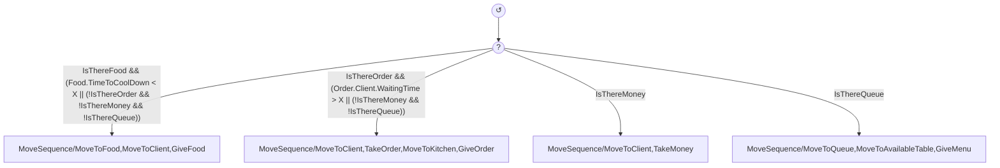
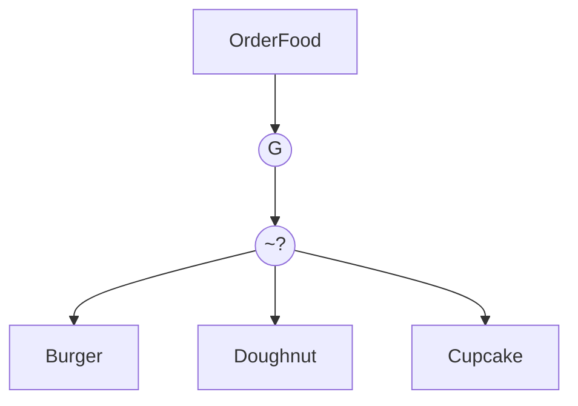
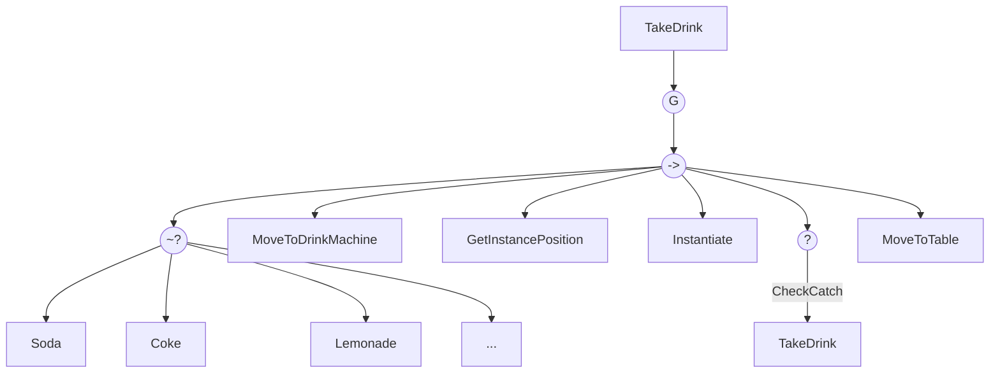
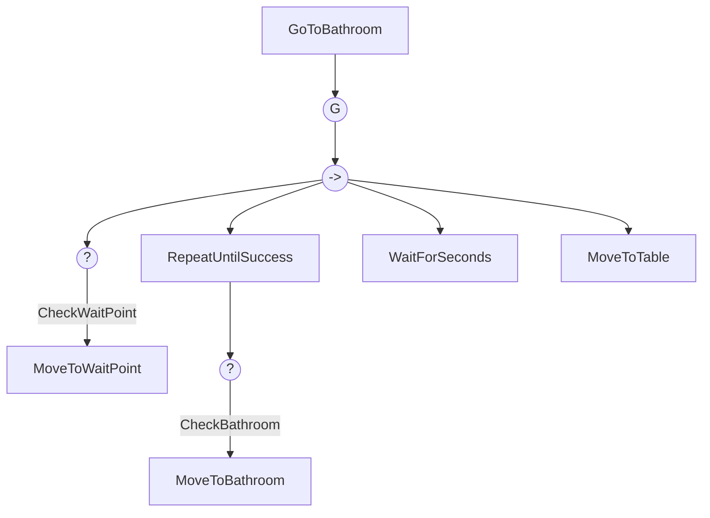
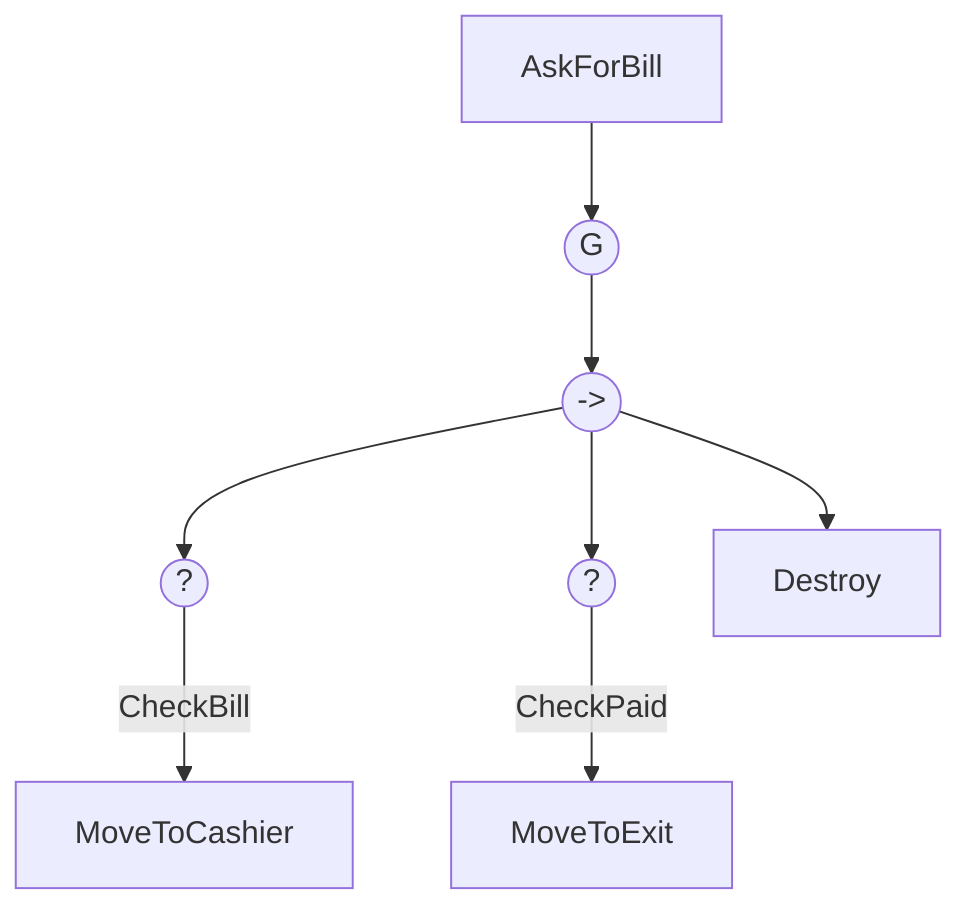

# IAV - Proyecto Final

> [Yi (Laura) Wang Qiu](https://github.com/LauraWangQiu)

Este proyecto pertenece a la asignatura de Inteligencia Artificial para Videojuegos del Grado en Desarrollo de Videojuegos de la UCM.

## Objetivo

Los objetivos de este proyecto se precisan en el siguiente [link](https://narratech.com/es/docencia/prueba/).

## Contexto

`Jorge` es un camarero que trabaja con sus padres en el mismo restaurante. A `Jorge` le han dejado todo el salón para él solo durante un ajetreado domingo. ¿Será capaz de apañárselas?

Habrá una cola de clientes, unas mesas con dos asientos cada mesa, un espacio para sacar los platos, un espacio para sacar las bebidas, un baño con dos lavabos y una puerta de entrada/salida de los clientes.

## Características

### Característica A

`Jorge` podrá ser dirigido por un árbol de comportamientos como una IA o mediante el control del usuario. Para cambiar de estado, se pulsará el espacio `SPACE`.

### Característica B

Los clientes tendrán una lista de deseos: pedir comida (y dentro del menú, cualquier plato), pedir bebida (cualquiera), ir al baño o pedir la cuenta para irse. Depende de cada deseo, los clientes cambiarán de comportamiento.

### Característica C

El baño está compuesto por dos lavabos, por lo que es posible que se genere una cola para ir.

### Característica D

Todas las acciones implican cierta cantidad de tiempo, por ejemplo, atender a los clientes en la mesa, hacer los platos, ir al baño, etc.

### Característica E

Los clientes se enfadarán si `Jorge` tarda mucho en atenderles o servirles los platos o llevarles las bebidas.

## Punto de partida

La versión de Unity utilizada es **Unity 2022.3.5f1**.

Partimos de un proyecto en blanco con las siguientes características:

- **ProyectoFinal**: escena en la que se desarrollará el proyecto.
- **BehaviorBricks**: asset pack de Behavior Bricks para Unity.

## Diseño de la solución

Realizaremos diferentes árboles de comportamiento para `Jorge` y los clientes:

- `Jorge` tendrá un árbol de comportamiento que le permitirá atender a los clientes para asignarles una mesa, tomarles nota, llevarles los platos y cobrarles.

La variable `X` será el tiempo de espera máximo para cada acción.

La idea es priorizar la entrega de comida, seguido de la toma de pedidos, la recogida de dinero y la asignación de mesas.

Es muy importante que `Jorge` no se quede parado en ningún momento y teniendo en cuenta que las acciones tienen un tiempo de ejecución, se deberá tener en cuenta el tiempo de espera máximo para cada acción.

Los platos de comida tendrán un tiempo de enfriamiento, por lo que si `Jorge` no los entrega a tiempo, los clientes se enfadarán. Es por eso que se encuentra en la primera rama del árbol de comportamiento.

Luego, se encuentra la toma de pedidos pues es la segunda acción más importante. Si no se toman los pedidos a tiempo, los clientes se enfadarán. Además, tras llevar la tanda a la cocina, se deberá esperar a que los platos estén listos por lo que durante ese tiempo, `Jorge` podrá realizar otras acciones.

La recogida de dinero es la tercera acción más importante. Esto es debido a que si no se cobra a los clientes, no se podrá asignar la mesa a otro cliente.

Cuando `Jorge` dé la comida a los clientes, se les sumará en la cuenta del cliente el precio del plato `ChargedMoney`.

- Los clientes tendrán una lista de deseos y cada deseo tendrá un árbol de comportamiento que les permitirán pedir comida, coger bebida, ir al baño y pedir la cuenta.

Para controlar qué deseo tiene cada cliente, se utilizará una cola de deseos. Cada vez que un cliente termine su deseo, se le asignará otro de forma aleatoria (`SelectRandomWish`).

Los deseos que tendrán los clientes son:

- **Pedir comida**: si previamente se han sentado, podrán pedir un plato de comida.

Una vez recibida la comida, se les sumará en la cuenta del cliente el precio de la bebida `owingMoney`.

Con el RandomSelector, se seleccionará un plato de comida de forma aleatoria entre las propuestas.

- **Coger bebida**: si previamente se han sentado, podrán coger una bebida.

Una vez cogida la bebida, se les sumará en la cuenta del cliente el precio de la bebida `owingMoney`.

Con el RandomSelector, se seleccionará una bebida de forma aleatoria entre las propuestas. Luego, se moverá hacia la máquina de bebidas, cogerá la bebida, comprobará si la ha cogido y se dirigirá a la mesa.

- **Ir al baño**:

Se mueve al punto de espera, espera a que haya un lavabo libre y se dirige al lavabo. Se esperará una cierta cantidad de tiempo en el baño y, una vez terminado, se dirigirá a la mesa.

- **Pedir la cuenta**: si previamente tomaron algo (comida o bebida), se dirigirán a la caja para pagar.

Se dirigirá a la caja, comprobará si ha pagado y una vez pagado se mueve a la salida y se destruye su instancia.

## Pruebas y métricas

| Pruebas | Links |
|:-:|:-:|
| **Característica A** | |
| Al pulsar el `SPACE`, se intentará controlar a `Jorge` clicando en la escena. Al pulsar nuevamente el `SPACE`, `Jorge` volverá a ser manejado por la IA |  |

| Pruebas | Links |
|:-:|:-:|
| **Característica B** | |
| Comprobar que los clientes pidan comida y bebida aleatorios. Primero, solo dando una opción de comida y bebida. Luego, con más de una opción. |  |
|  |  |

| Pruebas | Links |
|:-:|:-:|
| **Característica C** | |
| Asignar a varios clientes el deseo de ir al baño. Comprobar que se genera una cola de espera. |  |
| Comprobar que después de un determinado tiempo, se libera un lavabo. |  |

| Pruebas | Links |
|:-:|:-:|
| **Característica D** | |
| Aplicar diferentes tiempos a cada acción. Comprobarlos desde la consola. |  |

| Pruebas | Métricas | Links |
|:-:|:-:|:-:|
| **Característica E** | | |
| Comprobar el estado de enfado de los clientes. Manejando a `Jorge` sin IA, dejar que el tiempo de espera de los clientes aumente y se enfaden. |  |

## Producción

Observa la tabla de abajo para ver el estado y las fechas de realización de las mismas. Puedes visitar el proyecto de GitHub en el siguiente [link](https://github.com/users/LauraWangQiu/projects/2/).

| Estado  |  Tarea  |  Fecha  |  
|:-:|:--|:-:|
| ✔️ | Diseño: Primer borrador | 15-05-2024 |
|  | Característica A | ..-05-2024 |
| ✔️ | Característica B | 30-05-2024 |
| ✔️ | Característica C | 30-05-2024 |
|  | Característica D | ..-05-2024 |
|  | Característica E | ..-05-2024 |

## Licencia

Yi (Laura) Wang Qiu, autora de la documentación, código y recursos de este trabajo, concedo permiso permanente a los profesores de la Facultad de Informática de la Universidad Complutense de Madrid para utilizar este material, con sus comentarios y evaluaciones, con fines educativos o de investigación; ya sea para obtener datos agregados de forma anónima como para utilizarlo total o parcialmente reconociendo expresamente nuestra autoría.

Una vez superada con éxito la asignatura se prevee publicar todo en abierto (la documentación con licencia Creative Commons Attribution 4.0 International (CC BY 4.0) y el código con licencia GNU Lesser General Public License 3.0).

## Referencias

Los recursos de terceros utilizados son de uso público.

- *AI for Games*, Ian Millington.
- [Liquid Snake](https://ceur-ws.org/Vol-3305/paper7.pdf)
- Behavior Bricks de PadaOne Games (empresa de base tecnológica de la UCM)
https://assetstore.unity.com/packages/tools/visual-scripting/behavior-bricks-74816
- Unity, Navegación y Búsqueda de caminos
https://docs.unity3d.com/es/2021.1/Manual/Navigation.html
- Unity 2018 Artificial Intelligence Cookbook, Second Edition (Repositorio)
https://github.com/PacktPublishing/Unity-2018-Artificial-Intelligence-Cookbook-Second-Edition 
- Unity Artificial Intelligence Programming, 5th Edition (Repositorio)
PacktPublishing/Unity-Artificial-Intelligence-Programming-Fifth-Edition: Unity Artificial Intelligence Programming – Fifth Edition, published by Packt (github.com)
- CoffeeShop Starter Pack: https://assetstore.unity.com/packages/3d/props/coffeeshop-starter-pack-160914
- Fast Food Restaurant Kit: https://assetstore.unity.com/packages/3d/environments/fast-food-restaurant-kit-239419
- Cutlery: https://assetstore.unity.com/packages/3d/props/food/cutlery-silverware-pbr-106932
- Customizable Kitchen Pack: https://assetstore.unity.com/packages/3d/props/interior/customizable-kitchen-pack-22269
- Food Pack | Free Demo: https://assetstore.unity.com/packages/3d/props/food/food-pack-free-demo-225294
- Paper panels: https://gamedeveloperstudio.itch.io/paper-panels
- Retro Pixel Ribbons, Banners and Frames 2: https://bdragon1727.itch.io/retro-pixel-ribbons-banners-and-frames-2
- Free 16x16 Pixel Food Icons: https://electrikjelli.itch.io/free-pixel-food-icons
- Lemonade 64x64: https://rone3190.itch.io/lemonade-64x64